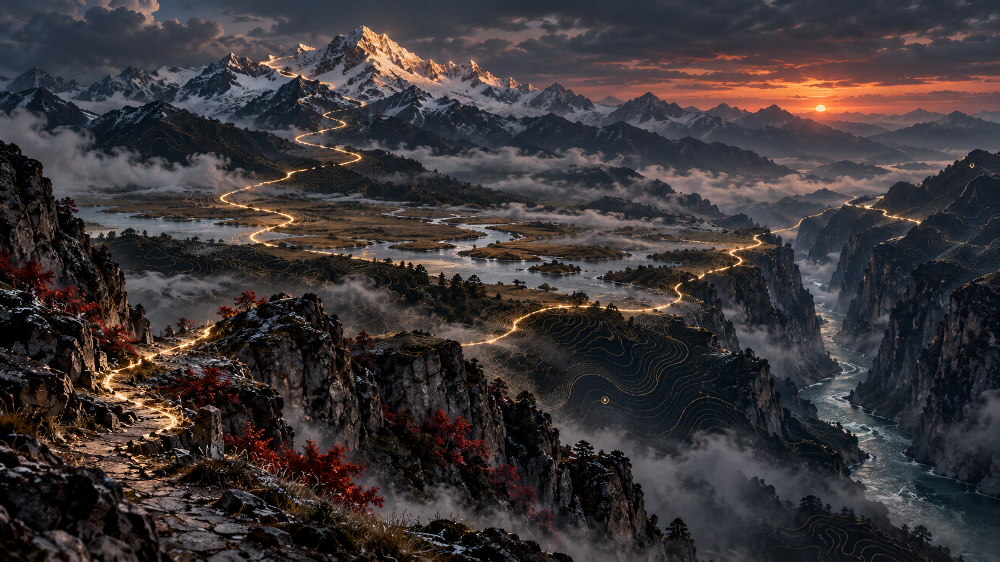

<p align="center">
  
</p>

<h1 align="center">重走险关 · ChangZheng</h1>

<p align="center">
  <strong>Retrace the Pass</strong> — decode five natural barriers of the Long March<br/>
  with real geography, theatre-mode storytelling, and decision moments.<br/>
  用地形、气候与水文数据，重读长征五道天险；剧场叙事 · 决策推演 · 离线可跑。
</p>

<p align="center">
  <a href="#english">English</a> ·
  <a href="#中文">中文</a> ·
  <a href="./DEPLOY.md">Deploy / 部署</a> ·
  <a href="https://changzheng.zhaopeinan.com">Live Demo</a>
</p>

<p align="center">
  
  
  
  
</p>

---

<a id="english"></a>

## English

### What it is

**ChangZheng / 重走险关** is an interactive narrative experience built for a digital-history competition track (*Hazard Decoding*). Along a Long March spatiotemporal map, it focuses on five representative natural barriers:

| Gate | Barrier |
| --- | --- |
| Jiaopingdu | Jinsha River crossing |
| Luding Bridge | Dadu River iron-chain bridge |
| Jiajinshan | First great snow mountain |
| Songpan Grassland | High-altitude marsh |
| Lazikou | Final mountain pass |

Each gate combines **scientific panels** (terrain, altitude–oxygen, climate, hydrology, landform risk), a **signature visualization**, and a **decision moment** where visitors choose under historical constraints, then see a qualitative outcome contrasted with the Red Army’s recorded choice and sources.

Product tone: **museum exhibition × data journalism** — solemn gold on deep charcoal, not gamified candy.

### Highlights

- **Theatre mode & free scroll** — chaptered one-screen acts (keyboard / wheel / touch) or classic continuous scroll; preference remembered in `localStorage`
- **Interactive Long March map** — standard basemap + independent SVG route / gates; scrub the timeline, pan / zoom, jump to a pass
- **Jiajinshan 3D traverse** — Three.js + NASA SRTM elevation, orbit / fly-through, live altitude · temperature · oxygen HUD
- **Decision theatre** — looping ambience video, typewriter lines, outcome bars, historical seal; advance locked until a choice is made (theatre mode)
- **Zero install** — double-click `index.html` or any static server; no CDN, no login, no backend
- **Accessible** — responsive desktop / tablet / phone; `prefers-reduced-motion` softens animation and audio

### Stack

| Layer | Choice |
| --- | --- |
| UI | Native HTML / CSS / JavaScript |
| 3D | Three.js (vendored under `assets/vendor/`) |
| Audio | Recorded BGM (CC BY 4.0) + procedural Web Audio fallback |
| Data | Private local datasets (not in public git); live demo is complete |
| Hosting | Any static host (see [DEPLOY.md](./DEPLOY.md)) |

### Quick start

```bash
git clone https://github.com/zhaopeinan/ChangZheng.git
cd ChangZheng

# Option A — open the file directly
open index.html          # macOS
# start index.html       # Windows

# Option B — local static server
python3 -m http.server 8000
# → http://localhost:8000
```

Public clones without private datasets will not render the full narrative. Use the [live demo](https://changzheng.zhaopeinan.com) instead.

### Project layout

```text
├── index.html                 Entry shell
├── LICENSE                    MIT
├── DEPLOY.md                  Generic static-host guide (no secrets)
├── docs/assets/banner.png     Repository hero art
└── assets/
    ├── css/main.css           Design system
    ├── js/main.js             Interaction + 3D scenes
    ├── js/audio.js            Web Audio engine
    ├── vendor/three.iife.js   Local Three.js build
    ├── audio/                 Theme BGM (CC BY 4.0)
    ├── video/                 Seamless ambient loops per gate
    ├── data/README.md         Notes only — datasets stay private
    └── img/                   Illustration / atmosphere art (no basemap tiles)
```

> **Note:** Gate JSON, map geometry, elevation rasters, and standard basemap images are **intentionally omitted** from this public repository. See the live demo for the complete experience.

### Science & integrity

- **Grade A** facts cite multi-source official / major media consensus (pass altitudes, bridge specs, ferry counts, pass width, etc.)
- **Grade B** facts cite single scholarly or specialized sources
- **Derived** values (temperature lapse rate, equivalent oxygen) are labeled as estimates on page
- **Uncertain** items are marked 待考 / pending; conflicting records are shown side by side
- Decision outcomes are **relative risk sketches**, not numerical simulations

### Map compliance

Basemap: Standard Map of China 1∶7.4M from the Ministry of Natural Resources map service, review number **GS(2023)2767**. The original map content is cited as-is (CMYK→RGB only). Long March route, nodes, and gate markers are an **independent SVG overlay**. Lon/lat → pixel uses a polynomial fit from control points and manual visual checks.

### Privacy & what is not in this repo

This public repository ships **engine code, presentation assets, and docs** — not research datasets or credentials.

**Not published:**

- Gate / map / terrain **JSON & inline data** (`assets/data/*` except the README note)
- Standard **basemap tiles** and **SRTM height rasters**
- Cloud credentials, SSH keys, private server inventories, analytics tokens, any `*.env` / `aliyun.env`

Keep operational secrets in a password manager or a local `DEPLOY.local.md` (gitignored). Restore private datasets from your offline backup if you maintain a full local build.

### License & attribution

- **Code & site structure:** [MIT](./LICENSE)
- **Theme music:** *Imperial China Cinematic* — Shane Ivers ([silvermansound.com](https://www.silvermansound.com)), **CC BY 4.0** (attribution retained in-product and here)
- **Elevation:** NASA SRTM via AWS Open Data elevation tiles (terrarium)
- **Basemap:** MNR standard map, GS(2023)2767 — follow Chinese map-use regulations when redistributing map imagery
- **AI illustration:** atmosphere art only; not historical evidence

---

<a id="中文"></a>

## 中文

### 这是什么

**重走险关** 是面向数智交互竞赛「历史回望 · 险阻解码」方向的交互作品。以中央红军长征时空地图为主线，聚焦五处代表性自然险阻：

| 险关 | 类型 |
| --- | --- |
| 皎平渡 | 金沙江渡口 |
| 泸定桥 | 大渡河铁索桥 |
| 夹金山 | 第一座大雪山 |
| 松潘草地 | 高原沼泽 |
| 腊子口 | 北上最后隘口 |

每一关提供**科学解码**（地形剖面、海拔—含氧、气候、水文、地貌风险）、**特色可视化**，以及**决策时刻**：在历史情境中做选择、看定性后果推演，再对照红军真实抉择与史料出处。

气质定位：**博物馆展览 × 数据叙事**——深炭鎏金，克制庄重，而不是轻浮游戏皮。

### 核心能力

- **剧场模式 / 自由滚动** — 分幕单屏翻阅（键盘 / 滚轮 / 触控）或经典连续滚动；偏好写入 `localStorage`
- **可交互长征地图** — 标准底图 + 独立 SVG 路线与险关；时间轴拖曳、平移缩放、点击跳转
- **夹金山 3D 穿越** — Three.js + NASA SRTM 真实高程，环绕 / 飞行，HUD 实时海拔 · 气温 · 含氧
- **决策剧场** — 循环氛围视频、打字机台词、后果条与史料印章；剧场模式下未抉择不可前进
- **零依赖离线** — 双击 `index.html` 或任意静态服务器；无 CDN、无登录、无后端
- **无障碍友好** — 桌面 / 平板 / 手机自适应；尊重 `prefers-reduced-motion`

### 技术栈

| 层 | 选型 |
| --- | --- |
| 界面 | 原生 HTML / CSS / JavaScript |
| 三维 | Three.js（本地打包于 `assets/vendor/`） |
| 音频 | 实录 BGM（CC BY 4.0）+ Web Audio 程序化回退 |
| 数据 | 私有本地数据集（不进公开仓库）；完整体验见线上演示 |
| 部署 | 任意静态托管（见 [DEPLOY.md](./DEPLOY.md)） |

### 快速开始

```bash
git clone https://github.com/zhaopeinan/ChangZheng.git
cd ChangZheng

# 方式 A — 直接打开
open index.html

# 方式 B — 本地静态服务
python3 -m http.server 8000
# → http://localhost:8000
```

公开克隆若不含私有数据集，无法完整渲染叙事内容，请直接访问线上演示。

线上演示：[changzheng.zhaopeinan.com](https://changzheng.zhaopeinan.com)

### 两种浏览模式

**剧场模式（默认）**：序章 → 背景 → 地图十幕 → 五关（各 6–7 幕）→ 尾声字幕 → 结语；一屏一幕。可用 `←` `→` `空格`、滚轮、触控竖滑翻幕；决策幕未点选前锁定前进。

**自由滚动**：适合减弱动效偏好或想纵览全文的用户；sticky 地图主线与险关顺序展开，交互能力保留。

### 科学依据（摘要）

- **A 级**：官方 / 权威媒体多源一致的关键事实（垭口海拔、桥长铁索、渡江规模、隘口宽度等）
- **B 级**：单一学术或专项来源
- **推算值**：气温垂直递减、等效含氧等，页面已标注
- **待考 / 口径分歧**：缺实测记录或两说并存者，页面并标

完整来源与推算方法见结语页与站内数据卡片。决策后果为相对风险示意，**非精确仿真**。

### 地图合规

底图为自然资源部标准地图服务 **中国地图 1∶740 万（界线版·无邻国·线划一）**，审图号 **GS(2023)2767号**，原幅引用（仅做 CMYK→RGB）。长征路线、节点、险关标记为**独立 SVG 叠加层**，不改动底图内容。

### 隐私、数据与敏感信息

本公开仓库只发布**交互引擎、展示素材与文档**，不发布研究数据集与凭证。

**不会上传：**

- 险关 / 地图 / 地形等 **JSON 与内联数据**（`assets/data/*`，仅保留说明 README）
- 标准**底图瓦片**与 **SRTM 高程栅格**
- 云账号 / SSH 凭证、私有服务器清单、统计 Token，以及任何 `*.env` / `aliyun.env`

运维机密请放在密码管理器或本地 `DEPLOY.local.md`（已被忽略）。完整本地构建请从离线备份恢复私有数据集。完整体验见线上演示。

### 许可与署名

- **代码与站点结构：** [MIT](./LICENSE)
- **主题音乐：** *Imperial China Cinematic* — Shane Ivers（[silvermansound.com](https://www.silvermansound.com)），**CC BY 4.0**
- **高程数据：** NASA SRTM（经 AWS Open Data elevation-tiles）
- **底图：** 自然资源部标准地图，审图号 GS(2023)2767 — 再分发地图影像时请遵守相关法规
- **AI 配图：** 仅作氛围，不作史实依据

---

<p align="center">
  <sub>1934.10 — 1936.10 · Decode the pass. Honor the march.</sub>
</p>
